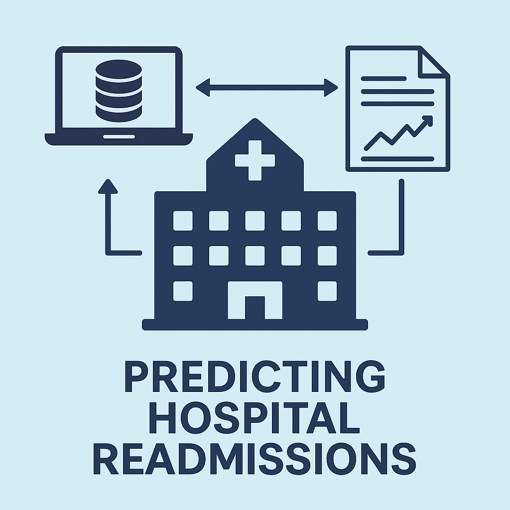

# 🏥 predictionReadmissions



Disclosure: Used LLMs to improve readability wherever required. 

> ⚠️ This project requires access to a local MySQL database. Connection credentials are managed via a `.env` file, which is not included in this repository for security reasons.
>
> To run the project locally:
>
> 1. Create a `.env` file in the project root.
> 2. Define the following environment variables:
>
>    * `MYSQL_HOST=localhost`
>    * `MYSQL_PORT=3306`
>    * `MYSQL_USER=your_username`
>    * `MYSQL_PASSWORD=your_password`
>    * `MYSQL_DATABASE=your_database_name`
> 3. Ensure your MySQL server is running and accessible.


A machine learning pipeline to predict 30-day hospital readmissions using electronic health record (EHR) data.

## 📂 Project Structure

```
predictionReadmissions/
├── data/
│   ├── raw/              # Source datasets (CSV, SQL dumps, etc.)
│   └── processed/        # Cleaned, feature-engineered data
├── notebooks/            # Exploratory data analysis & experiments
├── src/
│   ├── extraction.py     # Load/extract data (SQL, CSV)
│   ├── transformation.py # Data cleaning & feature engineering
│   ├── training.py       # Model training, evaluation & persistence
│   └── utils.py          # Shared helper functions
├── models/               # Saved models (e.g., .pkl, joblib)
├── requirements.txt      # Python dependencies
└── README.md             # This documentation
```

## ⚙️ Installation

Install Python dependencies with:

```bash
pip install -r requirements.txt
```

Typical dependencies include:

```
pandas
numpy
scikit-learn
sqlalchemy
joblib
# + optionally TensorFlow/PyTorch if leveraging deep learning
```

## 🚀 Usage

To run the full end-to-end pipeline:

```bash
python src/extraction.py
python src/transformation.py
python src/training.py \
    --model random_forest \
    --output models/random_forest.pkl
```

Each script supports CLI arguments for selecting input locations, model types, and output directories.

## 📊 Model & Evaluation

* Base models: Logistic Regression, Random Forest, Gradient Boosted Trees.
* (Optional) Deep learning versions using RNNs/CNNs on structured/unstructured EHR data.
* Evaluation metrics include: ROC‎‑AUC, Accuracy, Precision, Recall, F1‎‑Score, Calibration.
* Visual outputs: ROC and calibration plots saved to `models/` or visualized in `notebooks/`.

## 🧠 Data

This project uses the [Diabetes 130-US hospitals for years 1999-2008 dataset](https://archive.ics.uci.edu/dataset/296/diabetes+130-us+hospitals+for+years+1999-2008) from the UCI Machine Learning Repository.

### Dataset Overview:

* Contains over 100,000 hospital admissions for diabetic patients.
* Includes demographics, diagnoses, medications, lab results, procedures, and hospital readmission outcomes.
* Readmission is categorized as: `NO`, `<30` (within 30 days), or `>30`.
* Primary prediction target: whether a patient is readmitted within 30 days of discharge.

### Preprocessing Notes:

* Missing values are imputed.
* Categorical variables are encoded.
* Temporal features and aggregations are constructed.

## 🤩 Extensibility

* Swap models easily using training script flags.
* Add new feature engineering logic in `transformation.py`.
* Incorporate advanced architectures: RNNs, Transformers, multimodal approaches.

## 🎯 Outputs

* Trained model files (e.g., `.pkl`, `.joblib`) in `models/`.
* Evaluation metrics and plot artifacts.
* Optionally, prediction outputs for new datasets.

## ✅ Getting Started

1. Clone the repo:

   ```bash
   git clone https://github.com/toofanCodes/predictionReadmissions.git
   cd predictionReadmissions
   ```
2. Install dependencies:

   ```bash
   pip install -r requirements.txt
   ```
3. Start the pipeline:

   ```bash
   python src/extraction.py
   python src/transformation.py
   python src/training.py
   ```

## 📄 License

Released under the **MIT License**. See `LICENSE` for details.

---

**Need help or want to contribute?**
Feel free to open an issue or submit a pull request on GitHub.
